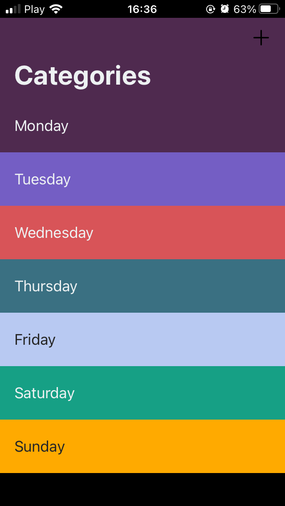
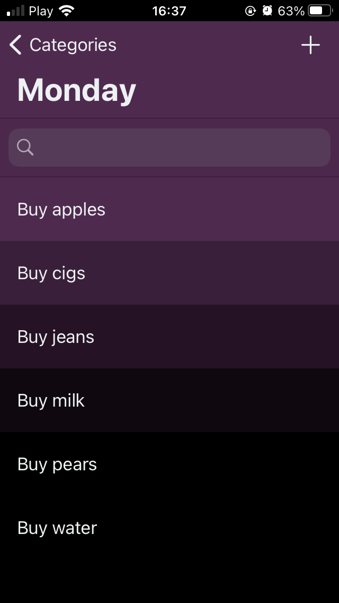
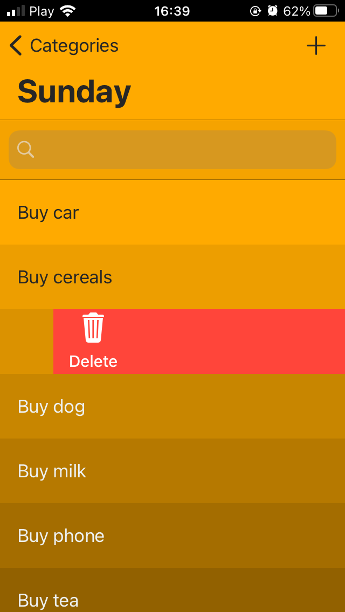
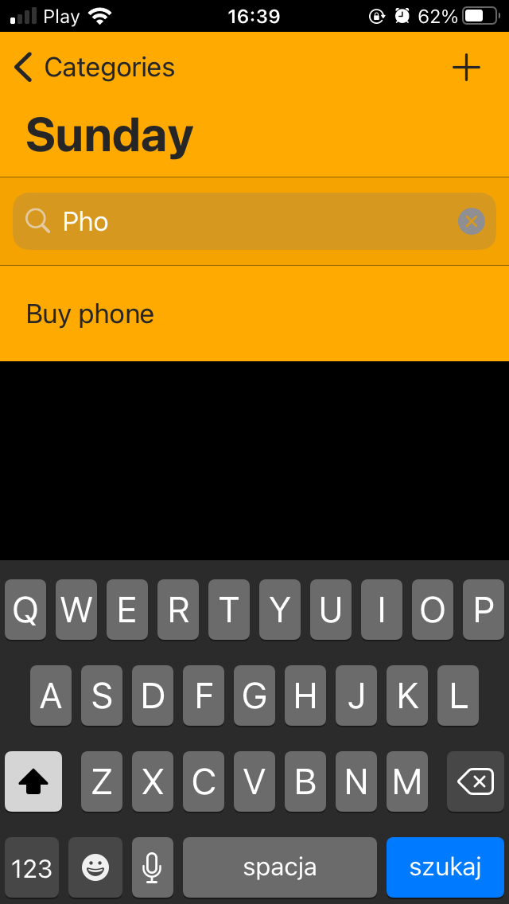

# 📜 realm-lista 
To Do List based on Realm 

You can add categories in which you can add items that you need to buy/do, 
new added categories will get random colour, items inside will have a gradient colour based on categories colour, 
also you can query through data based on date created, checkmark items and delete them.

This app uses: 
- MVC 
- UserDefaults 
- CoreData 
- Realm 
- Cocoapods 
- GitFlow 

Screenshots: 
    
